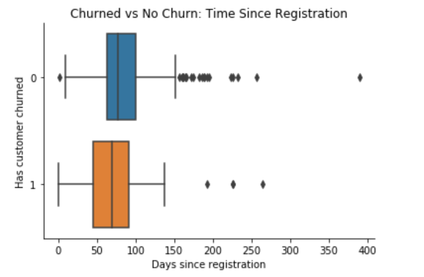
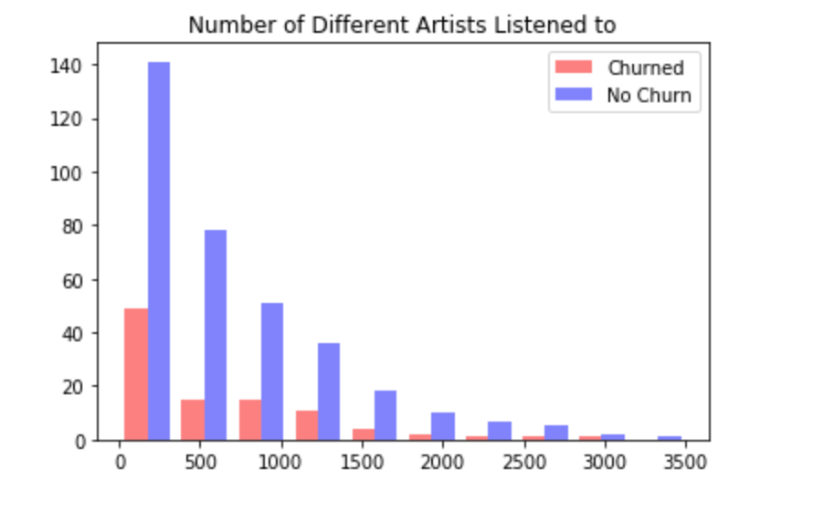
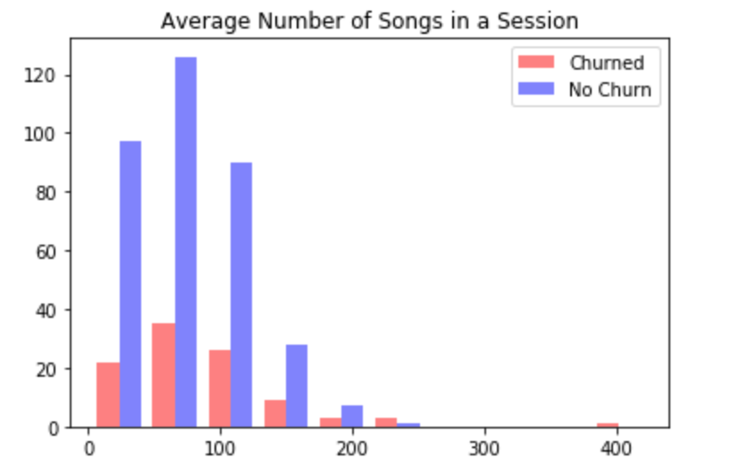

# Data Scientist Nanodegree Capstone Project
Capstone project for the Udacity Data Scientist Nanodegree. The goal of this project is to use Apache Spark to investigate and model music streaming data to predict when a user is going to cancel their account. Udacity provided four different prompts for the final project. I chose this project because it was the only one that required the use of Spark. I wanted to enhance and demonstrate my skills in Spark. 

We were provided with a very small subset of the data to which I used to set up my code in a jupyter notebook locally. We then could run analysis on a very large data set ( ~25 million rows ) using an AWS EMR cluster or use a medium sized dataset (~500 thousand rows ) using IBM Watson Studio. I originally performed this analysis connected to an AWS EMR cluster but finished the project using IBM Watson Studio. I go into these issues more later in the report. 

## Check these out 
#### [Blog Post on Medium](https://medium.com/@claytonvanhovel/udacity-data-science-nanodegrees-1b5a4c38c86d?sk=416f7a01ab1513b72caf732cb2202dcb)

#### [HTML Version of Notebook](https://htmlpreview.github.io/?https://github.com/claytv/DSND-Capstone/blob/master/dsnd_capstone.html)

## Data
The data was provided by Udacity and is intended to simulate music streaming logs from a company such as Spotify or Pandora. 

## Overview
* Process data
* Visualize some intuitions
* Create features
* Implement classification algorithms
* Tune models
* Evaluate trained models

### Processing
* Remove null values for timestamp columns 
* Add column 'churn' which represents if the event was an account cancellation event
* Convert timestamps to a readable format and compute difference between the time of the event and the time the user registered and store it in the variable 'days_since_reg'

### Visualizng
I visualized some intutions I had about the data. My intuitions that were most clearly supported by the visuals are the followin

#### How long a user has had their account

#### The variety of artists listened to 

#### Average number of songs in a session 

### Creating Features 

From the log data I created a dataframe with one row for each user and the following features

* Status ( Paid or Free )
* Days since registration
* Number of "Thumbs Up" given
* Variety of artists listened to
* Average length of listening session
* Number of songs added to a playlist

### Classification Algorithms 
I implemented and trained the models below using cross validation to return the corresponding results

#### Naive Model ( Assumes no one churns )
* Test Accuracy: 0.8
* Test F1-Score: 0.7
#### Logistic Regression ( maxIter=10 , regParam= 0.0)
* Test Accuracy: 0.81
* Test F1-Score: 0.74
#### Decision Tree ( impurity= 'entropy' , maxDepth= 2)
* Test Accuracy: 0.77
* Test F1-Score: 0.77
#### Gradient Boosted Trees ( maxIter= 5 , maxDepth= 10)¶
* Test Accuracy: 0.71
* Test F1-Score: 0.73

### Discussion of Results
The Naive model performed very well on this testing set because the distribution of classes was very uneven ( Not many users happened to cancel their account in the testing data ) which makes the naive model look really good. However, using the model with new data whos classifications are evenly split would produce far worse results. 

With that being said, I think that Logistic Regression or Decisicon Tree would be the best model for new data based off of their accuracy and F1 scores. However, for this project we do not know what is being done when a user is predicted to cancel their account. 

One assumption is that a promotion is offered when a user is predicted to cancel their account in order to incentivize the user to keep their account active. In this case if we assume that the cost of the promotion is signifigant and we want to minimize the number of promotions sent out we may look for a model that values precision more than accuracy. F1 score is the weighted average between precision and recall. Therefore, F1 may not be a good metric to look at in this situaion.

### Issues Throughout the Project
1.) The main issue I had throughout this project was setting up a cluster in order to leverage Sparks distributed computing. I first did this project with the small subset of data to get the structure down for using Spark. After this I headed over to AWS to create an EMR cluster with notebook attached. Working with the notebook was glitchy, difficult to configure and I could not get the notebook to properly convert to HTML so that others could see my work. After hours and hours of searching the internet for solutions combined with trial and error I decided to give IBM Watson Studio a try. 

The larger dataset was not available using IBM Watson Studio but I conducted my analysis just the same. IBM Watson Studio notebooks were a much easier way to use Spark for distributed computing in my opinion. 

2.) The other issue I had but also predicted would cause me some grief was learning to use Spark for data processing and modeling rather than Pandas and Sklearn. However, by the end of the project I really enjoyed using spark because it feels much more like SQL when working with the data. I did find Spark ML to be more difficult to work with than Sklearn. 

### Takeaways 
This project gave me another level of insight into working with big data and the challenges that go with it. Im happy to have gotten familiar with spark and look forward to using it more.

In addition to this analysis I am currently working on building a pipeline to train this model on new data using Airflow. 
